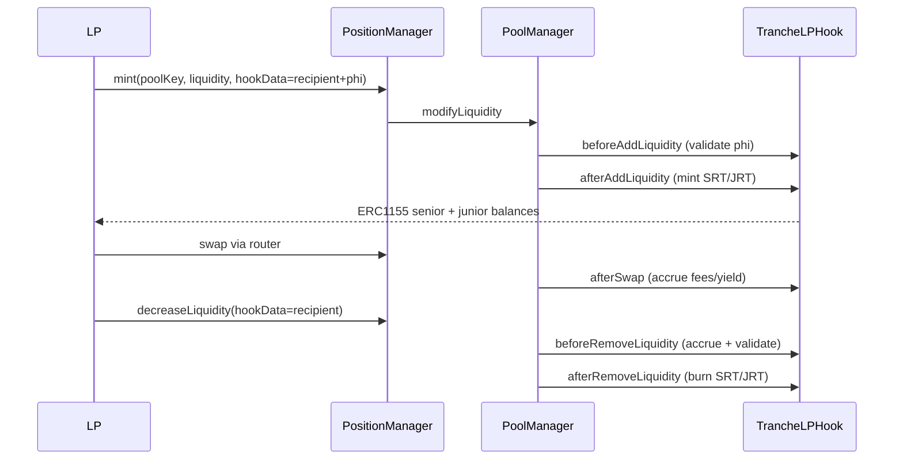

# Tranche LP Hook — End-to-End MVP

## Goal

Deliver a working Uniswap v4 hook sample that implements the deposit → accrue → withdraw loop from [docs/tranche_lp_design.md](docs/tranche_lp_design.md), using the simplest correct logic first. Sophisticated formulas (TWAP IL, model-derived rates, vol oracle, lazy accrual packing) live in dedicated library functions with stub implementations.

## Current Baseline

- Template hook: [`packages/hook/src/Counter.sol`](packages/hook/src/Counter.sol) — counter-only, missing `afterAddLiquidity` / `afterInitialize` / `afterRemoveLiquidity`
- Test harness: [`packages/hook/test/utils/BaseTest.sol`](packages/hook/test/utils/BaseTest.sol) + [`EasyPosm.sol`](packages/hook/test/utils/libraries/EasyPosm.sol) — full PositionManager mint/swap/decrease flow
- Keep `Counter.sol` and `Counter.t.sol` unchanged; add new tranche contracts alongside

## Architecture (MVP)



**Key design choices for v1:**

| Decision | MVP choice | Later upgrade path |
|---|---|---|
| Receipt tokens | ERC-1155 on hook (`SRT` / `JRT` token IDs per pool) | Metadata per §9 of design doc |
| Deposit split | `phi` in WAD via `hookData`: `abi.encode(address recipient, uint256 phi)` | Per-position NFT linkage |
| Value denomination | Sum of absolute token0 + token1 deposited (1:1 test pool) | TWAP numeraire (USDC) |
| Senior rate | Constant `8e16` (8% APY) in `TrancheMath.computeSeniorRate()` | Fee-derived / model-derived (Approach C) |
| IL | Always `0` in `TrancheMath.computeIncrementalIL()` | TWAP-based formula from §10.1 |
| Accrual timing | Full `_accruePool()` on every swap + deposit/withdraw | Lazy checkpoint on swap (§10.2) |
| User identity | `recipient` from `hookData` (hook `sender` is PositionManager) | Router allowlist |

## Files to Add

### 1. [`packages/hook/src/lib/TrancheTypes.sol`](packages/hook/src/lib/TrancheTypes.sol)

Shared constants, structs, errors:

```solidity
uint256 constant WAD = 1e18;
uint256 constant DELTA_MIN = 0.2e18;      // 20% min junior fraction
uint256 constant DEFAULT_SENIOR_RATE = 8e16; // 8% APY

struct TranchePool { seniorCapital, juniorCapital, seniorYieldAccrued, juniorFeeAccrued, ilAccrued, k0, seniorFixedRate, lastAccrualTime, epochStart, seniorDepositsPaused }
struct LPPosition { seniorDeposit, juniorDeposit, phi, depositTime, srtBalance, jrtBalance }

// Errors: InvalidPhi, SeniorDepositsPaused, InsufficientReceiptTokens, AggregatePhiExceeded
// Events: TrancheDeposited, TrancheWithdrawn, YieldAccrued, JuniorBufferAlert
```

### 2. [`packages/hook/src/lib/TrancheMath.sol`](packages/hook/src/lib/TrancheMath.sol)

Pure/view stub library — **all tunable logic isolated here**:

- `depositValue(BalanceDelta delta)` → `abs(amount0) + abs(amount1)`
- `splitDeposit(uint256 total, uint256 phi)` → `(senior, junior)`
- `computeSeniorRate(...)` → `DEFAULT_SENIOR_RATE` (stub)
- `computeSeniorDue(seniorCapital, rate, dt)` → `seniorCapital * rate * dt / 365 days`
- `computeFeeFromSwap(amountIn, feeTier)` → `amountIn * feeTier / 1e6`
- `computeIncrementalIL(...)` → `0` (stub)
- `computeJuniorNet(feeEarned, seniorAccrual, il)` → `feeEarned - seniorAccrual - il`
- `aggregatePhi(pool)` → weighted average phi check vs `1 - DELTA_MIN`

Uses `solmate/FixedPointMathLib` (already in deps) for WAD mul/div.

### 3. [`packages/hook/src/TrancheLPHook.sol`](packages/hook/src/TrancheLPHook.sol)

Main contract: `BaseHook` + `ERC1155`.

**State:**
- `mapping(PoolId => TranchePool) pools`
- `mapping(PoolId => mapping(address => LPPosition)) positions`
- Token IDs: `srtId(poolId) = uint256(PoolId.unwrap(poolId)) << 1`, `jrtId = ... | 1`

**Hook permissions** (per design §10.10):

```solidity
afterInitialize: true
beforeAddLiquidity: true
afterAddLiquidity: true
beforeRemoveLiquidity: true
afterRemoveLiquidity: true
afterSwap: true
// all others: false (no return-delta flags)
```

**Callback logic:**

| Callback | Action |
|---|---|
| `_afterInitialize` | Init pool: `k0`, `epochStart`, `lastAccrualTime`, `seniorFixedRate = computeSeniorRate()` |
| `_beforeAddLiquidity` | Decode `hookData`; validate `phi <= WAD`; reject if `seniorDepositsPaused` and `phi > 0`; simulate post-deposit aggregate phi cap |
| `_afterAddLiquidity` | `_accruePool()`; compute deposit value from `callerDelta`; split by phi; update pool + user position; `_mint(recipient, srtId, senior)` + `_mint(recipient, jrtId, junior)` |
| `_afterSwap` | `_accruePool()` using swap amount + fee tier for fee estimate; update vol checkpoint stub (no-op) |
| `_beforeRemoveLiquidity` | `_accruePool()`; decode recipient; compute burn amounts proportional to liquidity removed vs position liquidity |
| `_afterRemoveLiquidity` | Burn SRT/JRT; decrement pool/user capital; emit `TrancheWithdrawn` |

**Internal `_accruePool(PoolId id)`:**
1. `dt = block.timestamp - lastAccrualTime`
2. `seniorDue = TrancheMath.computeSeniorDue(...)`
3. `seniorAccrual = min(feeAccumulator, seniorDue)` — feeAccumulator incremented on swaps
4. `juniorNet = TrancheMath.computeJuniorNet(...)` with IL stub = 0
5. Update `seniorYieldAccrued`, `juniorFeeAccrued`, `lastAccrualTime`
6. Check junior buffer; set `seniorDepositsPaused` if below `DELTA_MIN`

**`uri()` for ERC1155:** return simple JSON data URI string distinguishing SRT vs JRT (minimal, no external metadata server needed for tests).

### 4. [`packages/hook/test/TrancheLPHook.t.sol`](packages/hook/test/TrancheLPHook.t.sol)

Mirror [`Counter.t.sol`](packages/hook/test/Counter.t.sol) setup but deploy `TrancheLPHook` with the full permission flag bitmask via `deployCodeTo`.

Helper: `_encodeHookData(address recipient, uint256 phi)`.

**Tests (demonstrate end-to-end):**

| Test | What it proves |
|---|---|
| `test_deposit_mintsSRTAndJRT` | LP mints with `phi=0.75e18`; hook mints 75/25 split of deposit value; pool `seniorCapital`/`juniorCapital` updated |
| `test_deposit_pureSenior` | `phi=1e18` mints SRT only, zero JRT |
| `test_deposit_pureJunior` | `phi=0` mints JRT only |
| `test_swap_accruesSeniorYield` | Seed pool + deposit; perform swap; warp time; assert `seniorYieldAccrued > 0` and `juniorFeeAccrued` reflects residual |
| `test_withdraw_burnsReceiptTokens` | Deposit then `decreaseLiquidity` with matching hookData; SRT/JRT balances decrease proportionally |
| `test_rejectExcessiveSeniorPhi` | When pool is already senior-heavy, deposit with high phi reverts `AggregatePhiExceeded` |
| `test_seniorDepositsPaused` | Manually set low junior buffer state (or deposit senior-only until cap); assert senior deposit rejected |

Optional: one test comparing IL stub output against analytical formula at a known price — documents future TWAP integration point even though stub returns 0 today.

### 5. Deploy script update (minor)

Update [`packages/hook/script/00_DeployHook.s.sol`](packages/hook/script/00_DeployHook.s.sol) to mine/deploy `TrancheLPHook` with the expanded flag set (or add `01_DeployTrancheHook.s.sol`).

## Hook Address Mining

Tests use the same pattern as `Counter.t.sol`:

```solidity
uint160 flags = uint160(
    Hooks.AFTER_INITIALIZE_FLAG
    | Hooks.BEFORE_ADD_LIQUIDITY_FLAG | Hooks.AFTER_ADD_LIQUIDITY_FLAG
    | Hooks.BEFORE_REMOVE_LIQUIDITY_FLAG | Hooks.AFTER_REMOVE_LIQUIDITY_FLAG
    | Hooks.AFTER_SWAP_FLAG
) ^ (0x4444 << 144);
```

Production deploy uses `HookMiner.find()` in the script (same as template).

## Out of Scope (Explicitly Deferred)

These are stubbed or skipped in MVP — noted in code comments referencing design doc sections:

- TWAP oracle IL (§10.1)
- Model-derived rate / epoch auctions (§4, §10.4)
- Rolling vol oracle (§10.5)
- Lazy accrual gas packing (§10.2)
- Rebalance-tranche post-deposit (§10.7)
- Insurance fund / senior debt deferral models (§10.6)
- Circuit breakers beyond basic junior-buffer pause (§10.8)
- Frontend / web package integration

## Verification

```bash
cd packages/hook && forge build && forge test -vvv --match-contract TrancheLPHook
```

CI ([`.github/workflows/ci-hook.yml`](.github/workflows/ci-hook.yml)) will pick up new tests automatically on push.

## Risk Notes for MVP

- Tranche tokens are **accounting receipts**, not wrapped LP — underlying liquidity stays in the Uniswap position NFT
- `recipient` in hookData must be trusted by the LP caller (same pattern as specifying `recipient` in PositionManager mint)
- No return-delta permissions used (avoids NoOp attack surface per v4 security foundations)
