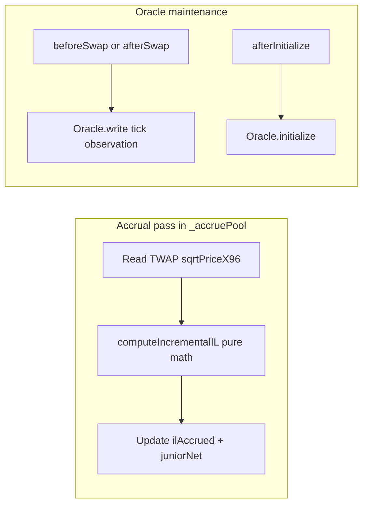

# TWAP-Based Impermanent Loss Plan

## Clarification

The stub lives in [`packages/hook/src/lib/TrancheMath.sol`](packages/hook/src/lib/TrancheMath.sol) (`computeIncrementalIL`), not in `TrancheTypes.sol`. [`TrancheTypes.sol`](packages/hook/src/lib/TrancheTypes.sol) will only gain shared constants (e.g. `TWAP_WINDOW`) and possibly a small oracle state struct.

The design doc references `IPoolManager.observe()`, but **v4-core has no built-in TWAP**. Observations must be recorded by the hook itself (OpenZeppelin [`BaseOracleHook`](https://github.com/OpenZeppelin/uniswap-hooks/tree/master/src/oracles/panoptic) pattern using [`Oracle.sol`](https://github.com/OpenZeppelin/uniswap-hooks/blob/master/src/oracles/panoptic/libraries/Oracle.sol)). Because a pool can only attach **one** hooks contract, `TrancheLPHook` must embed oracle observation alongside its existing tranche logic.



---

## 1. Add oracle dependency

Local `uniswap-hooks` v1.1.0 lacks `src/oracles/`. Pick one:

| Option | Action |
|--------|--------|
| **Recommended: vendor** | Copy `Oracle.sol` into [`packages/hook/src/lib/oracle/Oracle.sol`](packages/hook/src/lib/oracle/Oracle.sol) (MIT, from OZ uniswap-hooks master). No submodule churn. |
| Alternative | Bump `lib/uniswap-hooks` to a commit/tag that includes `src/oracles/panoptic/` and import `@openzeppelin/uniswap-hooks/src/oracles/panoptic/libraries/Oracle.sol`. |

---

## 2. Constants and pool state ([`TrancheTypes.sol`](packages/hook/src/lib/TrancheTypes.sol))

Add:

```solidity
uint32 constant TWAP_WINDOW = 1800;          // 30 min (design §11)
int24 constant MAX_ABS_TICK_DELTA = 8192;  // truncated-TWAP manipulation cap (OZ oracle default scale)
```

Extend `TranchePool` (or add a parallel mapping in the hook) with oracle bookkeeping:

```solidity
struct OracleState {
    uint16 index;
    uint16 cardinality;
    uint16 cardinalityNext;
}
```

Store `Oracle.Observation[65535]` per `PoolId` in the hook (same layout as `BaseOracleHook`).

Rename/clarify `k0`: keep as **entry sqrtPriceX96** (already set in `_afterInitialize` from `sqrtPriceX96`).

---

## 3. Oracle integration in [`TrancheLPHook.sol`](packages/hook/src/TrancheLPHook.sol)

### Hook permissions

Add `beforeSwap: true` (required to write at most one observation per block; matches OZ `BaseOracleHook`). Update test/deploy flag bitmask:

```solidity
Hooks.BEFORE_SWAP_FLAG | Hooks.AFTER_SWAP_FLAG | ...existing flags...
```

### Callback changes

| Callback | New behavior |
|----------|--------------|
| `_afterInitialize` | After setting `k0`, call `observations[poolId].initialize(timestamp, tick)` and seed `OracleState`. Optionally call `grow()` to cardinality ~12–64 for testability. |
| `_beforeSwap` | **New.** Read `(, tick,,) = poolManager.getSlot0(poolId)`, `observations.write(...)`, return `(beforeSwap.selector, ZERO_DELTA, 0)`. |
| `_accruePool` | Replace stub args with TWAP sqrt price (see §4). |

### TWAP reader (internal view)

Add `_twapSqrtPriceX96(PoolId id) internal view returns (uint160)`:

```solidity
uint32[] memory secondsAgos = new uint32[](2);
secondsAgos[0] = TWAP_WINDOW;
secondsAgos[1] = 0;
(, int56[] memory tickCumTrunc) = observations[id].observe(
    uint32(block.timestamp), secondsAgos, currentTick, index, cardinality, MAX_ABS_TICK_DELTA
);
int24 twapTick = int24((tickCumTrunc[1] - tickCumTrunc[0]) / int56(uint56(TWAP_WINDOW)));
return TickMath.getSqrtPriceAtTick(twapTick);
```

**Staleness guard** (design §10.8): if `block.timestamp - oldestObservation < TWAP_WINDOW`, return `0` incremental IL (skip accrual) rather than reverting. Tests will pre-seed observations across the window.

Expose `observe()` publicly (optional) for test assertions — mirrors `BaseOracleHook.observe`.

---

## 4. IL math in [`TrancheMath.sol`](packages/hook/src/lib/TrancheMath.sol)

### Updated signature

Replace the opaque 4×`uint256` stub with explicit price inputs:

```solidity
function computeIncrementalIL(
    uint160 sqrtPriceX96Entry,
    uint160 sqrtPriceX96Twap,
    uint256 totalPoolCapital,
    uint256 ilAccruedPrior
) internal pure returns (uint256 ilIncremental);
```

Drop unused `dt` — IL is price-path-dependent, not time-linear.

### Formula (50/50 CPAMM, reserve-denominated MVP)

For price ratio \(r = p_\text{twap} / p_\text{entry}\) where \(p = (\text{sqrtPriceX96} / 2^{96})^2\):

\[
\text{IL\_factor} = 1 - \frac{2\sqrt{r}}{1 + r}
\]

\[
\text{IL\_total} = \text{totalPoolCapital} \times \text{IL\_factor}
\]

\[
\text{IL\_incremental} = \max(0,\ \text{IL\_total} - \text{ilAccruedPrior})
\]

Use `FixedPointMathLib` + `FullMath` for `sqrt(r)` in WAD space. Edge cases:

- `sqrtPriceX96Entry == sqrtPriceX96Twap` → `0`
- `totalPoolCapital == 0` → `0`
- `ilAccruedPrior >= ilTotal` → `0` (IL recovery when price mean-reverts; junior benefits via unchanged `ilAccrued` — document this conservative choice; signed IL recovery is a follow-up)

Add a pure helper `ilFactorWad(uint160 entry, uint160 twap) internal pure returns (uint256)` for testability.

### Wire-up in `_accruePool`

```solidity
uint160 twapSqrt = _twapSqrtPriceX96(id);
uint256 ilIncremental = TrancheMath.computeIncrementalIL(
    uint160(pool.k0), twapSqrt, pool.seniorCapital + pool.juniorCapital, pool.ilAccrued
);
```

---

## 5. Tests

### New [`packages/hook/test/TrancheMath.t.sol`](packages/hook/test/TrancheMath.t.sol) (unit, no pool)

| Test | Assert |
|------|--------|
| `test_il_zeroAtEntryPrice` | entry == twap → 0 |
| `test_il_knownRatio_2x` | entry `SQRT_PRICE_1_1`, twap at tick +6932 (~2×) matches analytical `C * (1 - 2√2/3)` |
| `test_il_knownRatio_4x` | ~tick +13864 |
| `test_il_monotonicWithPriorAccrual` | prior `ilAccrued` caps incremental to non-negative delta |
| `test_il_zeroCapital` | returns 0 |

Use `TickMath.getSqrtPriceAtTick` for precise sqrt inputs.

### Update [`packages/hook/test/TrancheLPHook.t.sol`](packages/hook/test/TrancheLPHook.t.sol)

| Test | Assert |
|------|--------|
| Replace `test_ilStubReturnsZero` | Remove |
| `test_swap_accruesIlAfterTwapWindow` | Deposit → swaps over `TWAP_WINDOW` with `vm.warp` between blocks → `ilAccrued > 0` after price move away from 1:1 |
| `test_spotManipulation_doesNotMaxIl` | Single-block huge swap moves spot but TWAP (after prior observations) yields `ilAccrued` below spot-based IL upper bound |
| `test_il_skippedWhenOracleImmature` | Accrue before `TWAP_WINDOW` elapsed → `ilAccrued == 0` |

**Test helpers** to add:

- `_swapAndObserve(zeroForOne, amountIn)` — swap + warp 1 block
- `_buildTwapHistory(duration, swaps)` — loop swaps with `vm.warp(60)` between them
- `_spotBasedIlUpperBound()` — pure math using current slot0 for comparison

Use a **test-only shorter window** via one of:

- `TrancheLPHookTest` deploys `TrancheLPHookTestable` subclass overriding `TWAP_WINDOW` to `60` (cleanest), or
- `hook.increaseObservationCardinalityNext` + 60s warps (slower but no extra contract)

### Hook flag update in test `setUp`

Add `Hooks.BEFORE_SWAP_FLAG` to the mined address flags.

---

## 6. Files touched (summary)

| File | Change |
|------|--------|
| [`TrancheTypes.sol`](packages/hook/src/lib/TrancheTypes.sol) | `TWAP_WINDOW`, `MAX_ABS_TICK_DELTA`, optional `OracleState` |
| [`TrancheMath.sol`](packages/hook/src/lib/TrancheMath.sol) | Real `computeIncrementalIL` + `ilFactorWad` helper |
| [`TrancheLPHook.sol`](packages/hook/src/TrancheLPHook.sol) | Oracle storage, `_beforeSwap`, `_twapSqrtPriceX96`, updated `_accruePool` |
| `src/lib/oracle/Oracle.sol` | Vendored from OZ (or submodule import) |
| [`TrancheMath.t.sol`](packages/hook/test/TrancheMath.t.sol) | New unit tests |
| [`TrancheLPHook.t.sol`](packages/hook/test/TrancheLPHook.t.sol) | Integration + manipulation tests |
| Deploy script / HookMiner flags | Add `BEFORE_SWAP_FLAG` |

---

## 7. Verification

```bash
cd packages/hook && forge build && forge test -vvv --match-path "test/TrancheMath.t.sol|test/TrancheLPHook.t.sol"
```

---

## Out of scope (follow-ups)

- Full invariant \(k_0\) instead of sqrt-price reference
- Signed IL recovery reducing `ilAccrued` when price reverts
- USDC numeraire instead of `abs0 + abs1` MVP denomination
- Lazy accrual / checkpoint packing (design §10.2)
- Public `increaseObservationCardinalityNext` admin for production cardinality
