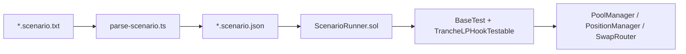

# Scenario Script Tester for TrancheLPHook

## Architecture



**Split of responsibility**
- **TypeScript (Bun)**: parse human-readable lines, validate syntax, normalize amounts/operators, write JSON.
- **Solidity**: read JSON via `vm.readFile` + `stdJson`, execute on-chain steps using existing patterns from [`TrancheLPHook.t.sol`](packages/hook/test/TrancheLPHook.t.sol), run assertions.

This reuses the proven setup: `deployArtifactsAndLabel()`, flag-mined `TrancheLPHookTestable`, `positionManager.mint` / `decreaseLiquidity`, `swapRouter.swapExactTokensForTokens`, and `abi.encode(recipient, phi)` hook data.

---

## 1. Scenario file format and JSON schema

**Input**: `.scenario` text files under [`packages/hook/test/scenarios/`](packages/hook/test/scenarios/) using syntax from [`.cursor/plans/test_script_req.md`](.cursor/plans/test_script_req.md).

**Output JSON** (one file per scenario, e.g. `example.scenario.json`):

```json
{
  "config": { "twapWindow": 60, "bootstrapLiquidity": false },
  "steps": [
    { "op": "lpDeposit", "user": "lpUser1", "amount0": "10", "amount1": "20000", "seniorPct": 80, "juniorPct": 20 },
    { "op": "swap", "user": "swapUser1", "amount0": "2" },
    { "op": "swap", "user": "swapUser2", "amount1": "100" },
    { "op": "pass", "seconds": 86400 },
    { "op": "lpWithdraw", "user": "lpUser1", "pct": 60 },
    { "op": "userAssert", "user": "lpUser1", "amount0": { "op": "gte", "value": "10.01" }, "amount1": { "op": "gt", "value": "20000" } },
    { "op": "hookAssertion", "user": "lpUser1", "srtPct": { "op": "approx", "value": "20" }, "jrtPct": { "op": "approx", "value": "3" } },
    { "op": "poolAssert", "amount0": { "op": "approx", "value": "1" }, "amount1": { "op": "approx", "value": "2000" } }
  ]
}
```

**Conventions**
- `amount0` = ETH (currency0), `amount1` = USDC (currency1) — both 18-decimal `MockERC20` in tests (human units like `10` → `10e18`).
- Empty CSV fields (`swap: swapUser2, , 100`) mean “omit that side”.
- `seniorPct + juniorPct` must equal 100 (parser error otherwise).
- Assertion ops: `gt`, `gte`, `lt`, `lte`, `eq`, `approx` (`~` in script).

**Default tolerances** (configurable in JSON `config`):
- ETH: `0.01e18`
- USDC: `100e18` (100 units at 18 decimals)
- Percent: `1` (1 percentage point)

---

## 2. TypeScript parser (`packages/hook/scripts/parse-scenario.ts`)

New files:
- [`packages/hook/scripts/parse-scenario.ts`](packages/hook/scripts/parse-scenario.ts) — CLI: `bun run parse-scenario -- test/scenarios/foo.scenario`
- [`packages/hook/scripts/scenario-types.ts`](packages/hook/scripts/scenario-types.ts) — shared types + validation

**Parser behavior**
- Strip comments/blank lines; split `op: rest` on first colon.
- CSV-split operands (trim whitespace); map `~` → `approx`, `>=` → `gte`, etc.
- Emit parse errors with line numbers.
- Write `<input>.json` alongside source file.

Add minimal [`packages/hook/package.json`](packages/hook/package.json) with script `"parse-scenario": "bun run scripts/parse-scenario.ts"`.

---

## 3. Solidity executor

### New test utilities

| File | Purpose |
|------|---------|
| [`packages/hook/test/utils/ScenarioRunner.sol`](packages/hook/test/utils/ScenarioRunner.sol) | Abstract runner extending `BaseTest`; loads JSON, dispatches steps |
| [`packages/hook/test/utils/ScenarioAssertions.sol`](packages/hook/test/utils/ScenarioAssertions.sol) | Compare helpers for `gt`/`gte`/`approx`/percent checks |
| [`packages/hook/test/TrancheScenario.t.sol`](packages/hook/test/TrancheScenario.t.sol) | Concrete test contract |

`ScenarioRunner` state per named user (`lpUser1`, etc.):
- `address` via `makeAddr(name)`
- `uint128 totalLiquidity` (cumulative minted)
- `uint256 tokenId` (latest position NFT; v4 positions are per-mint — runner aggregates liquidity on one tokenId per user by tracking the most recent mint, or sums liquidity across mints if same tick range — **simplest v1**: one position per user, last `lpDeposit` overwrites tracking only if we re-mint; better: **accumulate liquidity on same tick range** by calling `increaseLiquidity` on existing `tokenId` when user already has one)
- `uint256 phi` (WAD, from last deposit’s senior%)
- `uint256 initialSenior`, `uint256 initialJunior` (cumulative tranche amounts at deposit, from `TrancheDeposited` event or `hook.positions()` after each deposit)

### Operation mapping

**`lpDeposit`**
1. Fund user tokens from test contract (`deal` / `mint` + transfer).
2. `liquidity = LiquidityAmounts.getLiquidityForAmounts(sqrtPrice, tickLower, tickUpper, amount0, amount1)`.
3. `positionManager.mint(..., hookData = abi.encode(user, seniorPct * 1e16))` (80 → `0.8e18`).
4. Update user registry; record `initialSenior`/`initialJunior` from `TrancheMath.splitDeposit(depositValue, phi)` (cumulative).

**`swap`**
1. `vm.startPrank(swapUser)`; approve router.
2. If `amount0` set: `zeroForOne = true`, `amountIn = amount0`.
3. If `amount1` set: `zeroForOne = false`, `amountIn = amount1`.
4. `swapRouter.swapExactTokensForTokens(...)` (same as `_swap` in existing tests).

**`pass`**
- `vm.warp(block.timestamp + seconds)`.

**`lpWithdraw`**
1. `liquidityToRemove = user.totalLiquidity * pct / 100`.
2. `positionManager.decreaseLiquidity(tokenId, liquidityToRemove, 0, 0, user, deadline, abi.encode(user, phi))`.
3. **Report** (via `emit log_named_uint` / `console2`): total ETH & USDC received (balance delta), plus attributed SRT/JRT portions using burn ratio from `TrancheWithdrawn` event:
   - `srtEth = totalEth * burnSRT / (burnSRT + burnJRT)` (same for USDC and JRT share).

**`userAssert`**
- `assertToken(user, currency0, amount0Spec)` and/or `currency1`.

**`hookAssertion`** (per your choice: % of **initial** tranche amounts)
- `srtPctActual = pos.srtBalance * 100 / initialSenior` (handle zero initial)
- `jrtPctActual = pos.jrtBalance * 100 / initialJunior`
- Compare with `approx` tolerance.

**`poolAssert`**
- Read active liquidity + `slot0` → `LiquidityAmounts.getAmountsForLiquidity(...)` for pool reserves; compare `amount0`/`amount1`.

### Pool setup differences from [`TrancheLPHook.t.sol`](packages/hook/test/TrancheLPHook.t.sol)

- **No automatic bootstrap** when `config.bootstrapLiquidity = false` (default for scenarios) — pool starts empty except scenario deposits.
- Label tokens ETH/USDC in `deployCurrencyPair()` override.
- Keep `TEST_TWAP_WINDOW = 60` (configurable via JSON).

---

## 4. Foundry config

Update [`packages/hook/foundry.toml`](packages/hook/foundry.toml) `fs_permissions` to allow reading scenario JSON:

```toml
fs_permissions = [
  { access = "read", path = "./test/scenarios/" },
  { access = "read-write", path = "./.forge-snapshots/" }
]
```

---

## 5. Test entrypoints

[`TrancheScenario.t.sol`](packages/hook/test/TrancheScenario.t.sol):

```solidity
function test_scenario_example() public {
    runScenario("test/scenarios/example.scenario.json");
}
```

Optional parametrized test reading all `*.scenario.json` files (v2).

**Workflow**
```bash
cd packages/hook
bun run parse-scenario test/scenarios/example.scenario
forge test --match-contract TrancheScenario -vv
```

---

## 6. Example scenario + spec fixture

Create [`packages/hook/test/scenarios/example.scenario`](packages/hook/test/scenarios/example.scenario) mirroring the doc examples, plus generated JSON. Use it as the first integration test to validate parser + runner end-to-end.

---

## Key reuse from existing code

```76:78:packages/hook/test/TrancheLPHook.t.sol
function _encodeHookData(address recipient, uint256 phi) internal pure returns (bytes memory) {
    return abi.encode(recipient, phi);
}
```

```161:171:packages/hook/test/TrancheLPHook.t.sol
function _swap(bool zeroForOne, uint256 amountIn) internal {
    swapRouter.swapExactTokensForTokens({ ... });
}
```

Withdrawal burn logic already in hook (`burnRatio`, proportional SRT/JRT burn) — runner only needs to observe deltas/events for reporting.

---

## Out of scope (v1)

- Multiple positions per user across different tick ranges
- `hookAssertion` bases other than % of initial deposit
- Fork/mainnet scenarios
- Auto-running TS parser inside `forge test` via FFI (manual/CI pre-step is sufficient for v1)
