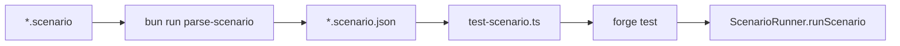

# Scenario test Bun scripts

## Problem

`[test_scenario(string calldata scenarioJsonPath)](packages/hook/test/TrancheScenario.t.sol)` is currently a **fuzz test** — Foundry generates random strings instead of accepting a CLI path. Running `forge test --match-test test_scenario` fails with garbage paths like `12ï&$Ô'...`.

**Fix (confirmed):** change to parameterless `test_scenario()` that reads `vm.envString("SCENARIO_JSON")`. Bun scripts set that env var before invoking `forge test`.




## 1. Solidity change

Update `[packages/hook/test/TrancheScenario.t.sol](packages/hook/test/TrancheScenario.t.sol)`:

```solidity
function test_scenario() public {
    runScenario(vm.envString("SCENARIO_JSON"));
}
```

`[ScenarioRunner.runScenario](packages/hook/test/utils/ScenarioRunner.sol)` already expects a **project-root-relative** path (e.g. `test/scenarios/simple01.scenario.json`) and joins it with `vm.projectRoot()`.

## 2. Shared path helpers

Add `[packages/hook/scripts/scenario-paths.ts](packages/hook/scripts/scenario-paths.ts)` with:

- `HOOK_ROOT` — `resolve(import.meta.dir, "..")`
- `scenarioJsonPath(inputPath)` — same logic as private `outputPath()` in `[parse-scenario.ts](packages/hook/scripts/parse-scenario.ts)` (`.scenario` → `.scenario.json`, else append `.scenario.json`)
- `resolveScenarioInput(arg)` — normalize user ARG:
  - if arg has no `/`, look in `test/scenarios/`
  - if missing `.scenario` suffix, append it
  - `resolve()` to absolute path under hook root
- `scenarioJsonRelative(inputPath)` — path relative to hook root for `SCENARIO_JSON` (e.g. `test/scenarios/simple01.scenario.json`)

Refactor `[parse-scenario.ts](packages/hook/scripts/parse-scenario.ts)` to import `scenarioJsonPath` from the shared module (remove duplicate).

## 3. `test-scenario` script

Add `[packages/hook/scripts/test-scenario.ts](packages/hook/scripts/test-scenario.ts)`:

1. Parse CLI: require exactly one ARG (after filtering `--`)
2. `resolveScenarioInput(ARG)` → absolute `.scenario` path; exit 1 if not found
3. Run parser: `Bun.spawn(["bun", "run", "scripts/parse-scenario.ts", scenarioPath], { cwd: HOOK_ROOT, stdout: "inherit", stderr: "inherit" })` — fail if non-zero
4. Compute `jsonRel = scenarioJsonRelative(scenarioPath)`
5. Run forge:

```bash
   SCENARIO_JSON=<jsonRel> forge test \
     --match-contract TrancheScenario \
     --match-test test_scenario \
     -vvv


```

   (`cwd: HOOK_ROOT`, inherit stdio, exit with forge status)

Log which scenario is running before each step for clarity.

## 4. `test-all-scenarios` script

Add `[packages/hook/scripts/test-all-scenarios.ts](packages/hook/scripts/test-all-scenarios.ts)`:

1. `readdirSync(test/scenarios/)` filtered to `*.scenario` (exclude `.scenario.json`)
2. Sort alphabetically for deterministic order
3. For each file, call shared `testScenario(scenarioPath)` from `test-scenario.ts` (export the core function; CLI `main` is a thin wrapper)
4. **Fail fast** on first parse or forge failure; print summary on success (`N scenario(s) passed`)

Current fixtures: `example.scenario`, `simple01.scenario`, `swapEthFullSenior.scenario`.

## 5. `package.json` scripts

Update `[packages/hook/package.json](packages/hook/package.json)`:

```json
{
  "scripts": {
    "parse-scenario": "bun run scripts/parse-scenario.ts",
    "test-scenario": "bun run scripts/test-scenario.ts",
    "test-all-scenarios": "bun run scripts/test-all-scenarios.ts"
  }
}
```

## Usage (from `packages/hook`)

```bash
bun run test-scenario simple01
bun run test-scenario test/scenarios/example.scenario
bun run test-all-scenarios
```

## Verification

After implementation:

```bash
cd packages/hook
bun run test-scenario simple01
bun run test-all-scenarios
```

Expect parse → forge test → pass/fail per scenario assertions. No changes to `foundry.toml` fs_permissions needed (already allows `./test/scenarios/`).

## Out of scope

- Root monorepo `package.json` proxy scripts (user did not request)
- Parallel forge execution (sequential is simpler and avoids shared-state issues)
- Skipping forge when JSON is already up-to-date (always re-parse per user spec)

