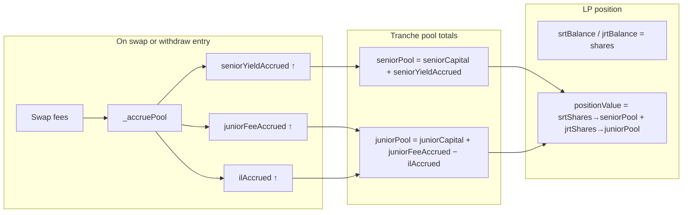

# Share-Based SRT/JRT Yield Settlement on Withdraw

## Problem

Today in [`TrancheLPHook.sol`](packages/hook/src/TrancheLPHook.sol):

- **Deposit:** mints SRT/JRT 1:1 with `senior` / `junior` principal (lines 203–207).
- **Accrual:** `_accruePool` updates pool-level `seniorYieldAccrued` / `juniorFeeAccrued` / `ilAccrued` using `DEFAULT_SENIOR_RATE` via [`TrancheMath.computeSeniorDue`](packages/hook/src/lib/TrancheMath.sol) — but never flows to LPs.
- **Withdraw:** burns shares and debits **principal only** using `totalPositionValue = seniorDeposit + juniorDeposit` (lines 256–273).

This contradicts the design doc ([`.cursor/plans/00_tranche_lp_design.input.md`](.cursor/plans/00_tranche_lp_design.input.md) §3 withdrawal) and your requirement: **100% exit must retire principal + all accrued tranche value**.

## Target Model

SRT/JRT become **shares** (ERC-4626-style) over pool tranche totals. Accrual changes the exchange rate; share count stays fixed until mint/burn.



**Invariant:** `sum(LP claim values) == seniorPool + juniorPool` at all times (modulo rounding).

---

## 1. Data model changes

**File:** [`TrancheTypes.sol`](packages/hook/src/lib/TrancheTypes.sol)

Add to `TranchePool`:

```solidity
uint256 srtTotalSupply;  // aggregate SRT shares
uint256 jrtTotalSupply;  // aggregate JRT shares
```

Clarify in comments that `LPPosition.srtBalance` / `jrtBalance` are **shares**, not reserve units.

Optionally extend `TrancheWithdrawn` event with economic claim amounts for scenario reporting:

```solidity
event TrancheWithdrawn(
    PoolId indexed poolId,
    address indexed recipient,
    uint256 burnSRT,
    uint256 burnJRT,
    uint256 seniorClaimBurned,
    uint256 juniorClaimBurned,
    uint256 withdrawValue
);
```

---

## 2. New pure math helpers

**File:** [`TrancheMath.sol`](packages/hook/src/lib/TrancheMath.sol)

Add:

| Function | Purpose |
|----------|---------|
| `seniorPool(seniorCapital, seniorYieldAccrued)` | `seniorCapital + seniorYieldAccrued` |
| `juniorPool(juniorCapital, juniorFeeAccrued, ilAccrued)` | `max(0, juniorCapital + juniorFeeAccrued − ilAccrued)` |
| `sharesToMint(depositAmount, totalSupply, poolTotal)` | First deposit: `depositAmount`; else `depositAmount.mulDivDown(totalSupply, poolTotal)` |
| `sharesToValue(shares, totalSupply, poolTotal)` | `shares.mulDivDown(poolTotal, totalSupply)` |
| `proRataBurn(shares, totalSupply, bucket)` | Pro-rata debit of a pool bucket on share burn |

`_accruePool` in the hook stays unchanged — it already produces the buckets shares index against.

---

## 3. Deposit flow (`_afterAddLiquidity`)

**File:** [`TrancheLPHook.sol`](packages/hook/src/TrancheLPHook.sol) ~lines 193–207

After `_accruePool` and `splitDeposit`:

```solidity
uint256 seniorPool = TrancheMath.seniorPool(pool.seniorCapital, pool.seniorYieldAccrued);
uint256 juniorPool = TrancheMath.juniorPool(pool.juniorCapital, pool.juniorFeeAccrued, pool.ilAccrued);

uint256 srtShares = TrancheMath.sharesToMint(senior, pool.srtTotalSupply, seniorPool);
uint256 jrtShares = TrancheMath.sharesToMint(junior, pool.jrtTotalSupply, juniorPool);

pool.seniorCapital += senior;
pool.juniorCapital += junior;
pool.srtTotalSupply += srtShares;
pool.jrtTotalSupply += jrtShares;

pos.seniorDeposit += senior;   // still tracks principal contributed
pos.juniorDeposit += junior;
pos.srtBalance += srtShares;
pos.jrtBalance += jrtShares;

_mint(recipient, srtId(id), srtShares, "");
_mint(recipient, jrtId(id), jrtShares, "");
```

**Effect:** If yield accrued before a second deposit, new LPs receive fewer shares per dollar — they cannot dilute existing LPs' yield.

---

## 4. Withdraw flow (`_afterRemoveLiquidity`)

**File:** [`TrancheLPHook.sol`](packages/hook/src/TrancheLPHook.sol) ~lines 255–278

Replace principal-only logic:

```solidity
uint256 seniorPool = TrancheMath.seniorPool(pool.seniorCapital, pool.seniorYieldAccrued);
uint256 juniorPool = TrancheMath.juniorPool(pool.juniorCapital, pool.juniorFeeAccrued, pool.ilAccrued);

uint256 srtValue = TrancheMath.sharesToValue(pos.srtBalance, pool.srtTotalSupply, seniorPool);
uint256 jrtValue = TrancheMath.sharesToValue(pos.jrtBalance, pool.jrtTotalSupply, juniorPool);
uint256 totalPositionValue = srtValue + jrtValue;

uint256 ratio = TrancheMath.burnRatio(withdrawVal, totalPositionValue);

uint256 burnSRT = pos.srtBalance.mulWadDown(ratio);
uint256 burnJRT = pos.jrtBalance.mulWadDown(ratio);

// Pro-rata pool bucket debits (principal + yield/IL together)
uint256 seniorPrincipalBurn = TrancheMath.proRataBurn(burnSRT, pool.srtTotalSupply, pool.seniorCapital);
uint256 seniorYieldBurn    = TrancheMath.proRataBurn(burnSRT, pool.srtTotalSupply, pool.seniorYieldAccrued);
uint256 juniorPrincipalBurn = TrancheMath.proRataBurn(burnJRT, pool.jrtTotalSupply, pool.juniorCapital);
uint256 juniorFeeBurn       = TrancheMath.proRataBurn(burnJRT, pool.jrtTotalSupply, pool.juniorFeeAccrued);
uint256 ilBurn              = TrancheMath.proRataBurn(burnJRT, pool.jrtTotalSupply, pool.ilAccrued);

pool.seniorCapital      -= seniorPrincipalBurn;
pool.seniorYieldAccrued -= seniorYieldBurn;
pool.juniorCapital      -= juniorPrincipalBurn;
pool.juniorFeeAccrued   -= juniorFeeBurn;
pool.ilAccrued          -= ilBurn;
pool.srtTotalSupply     -= burnSRT;
pool.jrtTotalSupply     -= burnJRT;
// ... update pos, _burn, emit
```

**100% withdraw:** `ratio == WAD` → all shares burned → LP's full `srtValue + jrtValue` (principal + accrued) retired from pool buckets.

**Partial withdraw:** Same fraction of shares and accrued value retired.

**ETH/USDC:** Still delivered by Uniswap `decreaseLiquidity` (`withdrawVal`). Tranche layer governs which entitlement is surrendered; it does not transfer extra tokens.

---

## 5. View helpers (tests + scenarios)

Add to [`TrancheLPHook.sol`](packages/hook/src/TrancheLPHook.sol):

```solidity
function positionValue(PoolId id, address lp) external view returns (uint256 srtValue, uint256 jrtValue);
```

Uses current pool buckets + `positions[id][lp]` share balances.

---

## 6. Tests

**File:** [`TrancheLPHook.t.sol`](packages/hook/test/TrancheLPHook.t.sol)

| Test | Asserts |
|------|---------|
| Update `test_withdraw_burnsReceiptTokens` | After swap + accrual + partial withdraw: `seniorYieldAccrued` decreases; `positionValue` decreases by ~withdraw proportion |
| `test_fullWithdraw_zerosAccruedClaim` | Deposit → swap → warp → 100% withdraw: all position fields zero; `seniorYieldAccrued` reduced by LP's share |
| `test_secondDepositorGetsFewerSharesAfterYield` | LP1 deposits → fees accrue → LP2 deposits same size: LP2 gets fewer SRT/JRT shares than LP1 got at deposit |
| `test_withdraw_srtValueIncludesYield` | Senior-only LP: after accrual, `positionValue.srtValue > seniorDeposit` |

Keep existing `test_swap_accruesSeniorYield` (pool-level accrual unchanged).

---

## 7. Scenario runner updates

**File:** [`ScenarioRunner.sol`](packages/hook/test/utils/ScenarioRunner.sol)

- **`_stepLpWithdraw` (~311–321):** Stop splitting ETH/USDC by `burnSRT + burnJRT` (share amounts). Use `seniorClaimBurned` / `juniorClaimBurned` from extended `TrancheWithdrawn` event, or call `hook.positionValue` before/after to attribute withdrawal to senior vs junior economic claim.
- **`_stepHookAssert` (~356–371):** Today compares `seniorDeposit` / `juniorDeposit` (principal). For post-yield scenarios, either:
  - Keep principal-based asserts for "fully withdrawn" cases (all zeros), or
  - Add optional `srtValuePct` / `jrtValuePct` asserts using `positionValue`.

No scenario file changes required for [`simple01.scenario`](packages/hook/test/scenarios/simple01.scenario) (no swaps → negligible yield).

---

## 8. Out of scope (follow-up)

### 8a. Tranche weight normalization

[`uhi9-devnotes.md`](../../.notes/uhi9-devnotes.md): `80/20` vs `800/200` already map to the same φ via `_phiFromWeights`; the share model fixes dilution when yield exists. No separate change needed unless deposit sizing relative to pool TVL is also wrong.

### 8b. Senior payout waterfall / junior liquidation (design §3) — what this plan does NOT do

The design doc ([`00_tranche_lp_design.input.md`](.cursor/plans/00_tranche_lp_design.input.md) §3, `beforeRemoveLiquidity`) describes a **reserve-backed waterfall** at withdrawal time. This plan implements **bookkeeping share settlement** only. The gap:

| Design §3 requirement | What this plan does | Gap |
|----------------------|----------------------|-----|
| `seniorPayout = seniorCapital + seniorYieldAccrued` paid **from real pool reserves** (`V_pool`) | Burns SRT shares and debits abstract `seniorCapital` + `seniorYieldAccrued` buckets | No link between bucket debit and actual ETH/USDC the LP receives from Uniswap |
| Seniors paid **first** on exit | Senior and junior claims burned **pro-rata in parallel** by `withdrawVal / positionValue` | No senior-first ordering over real token flows |
| If `V_pool` insufficient for senior claim, **junior capital liquidated** to back seniors | Junior bucket debited only when **that LP's JRT** is burned | No cross-tranche liquidation: remaining juniors are not tapped to honor a senior exit |
| `juniorPayout = max(0, V_pool − seniorPayout)` (residual after seniors) | `jrtValue` from share math over `juniorPool` bookkeeping total | Junior "payout" is an accounting figure, not `V_pool` minus senior cash out |
| Protection: `seniorPayout ≤ V_pool − max(0, juniorNet)` | Not checked | Senior exit could be allowed even when it would leave juniors below the design's safety floor |
| Hook computes payouts in **`beforeRemoveLiquidity`** (design §10.10) | `_beforeRemoveLiquidity` only accrues; burn math in `_afterRemoveLiquidity` | No pre-withdraw payout preview, ordering enforcement, or revert on insolvency |

**Concrete scenarios this plan does not handle:**

1. **Accounting vs reserves mismatch** — Tranche buckets (`seniorPool + juniorPool`) can grow from fee accrual while Uniswap LP value moves differently (IL, price range, partial liquidity). The plan uses `withdrawVal` only to pick a **burn ratio**, not to settle `seniorPayout` / `juniorPayout` against `V_pool`. An LP could burn claims worth X in bookkeeping while receiving Y in tokens, with no reconciliation.

2. **Junior buffer stress / wipeout** (design §10.11) — When IL erodes junior backing, design expects: seniors still paid par + yield while buffer holds; beyond that, **seniors take a haircut** proportional to remaining `V_pool`, juniors wiped first. This plan floors `juniorPool` at 0 in share math but never redistributes real reserves senior-first or implements the "junior wipeout → senior haircut" path.

3. **Fee shortfall / senior debt** (design §10.6 Model A) — When swap fees cannot cover `seniorDue`, unpaid yield accrues as **debt against junior capital** and juniors may be blocked from withdrawing until cleared. Current `_accruePool` caps `seniorAccrual` at `feeEarned` (yield is never "promised but unfunded" in buckets). No `seniorDebt` field, no withdraw gate, no junior-to-senior transfer on exit.

4. **Return-delta / token routing** — A full waterfall may need `afterRemoveLiquidityReturnDelta` (or a separate settle step) to **reallocate** the Uniswap withdrawal between senior and junior entitlement (e.g. senior LP gets USDC up to `seniorPayout` first). This plan leaves 100% of `withdrawVal` with the LP per normal Uniswap flow; tranche burn is side accounting only.

**What this plan *does* deliver (narrow scope):** In the **happy path** where bookkeeping totals track reality and the pool is solvent, burning SRT/JRT retires **principal + accrued yield/IL** from pool buckets pro-rata — fixing today's bug where only principal is debited. It does **not** implement the design's insolvency, priority, or reserve-settlement layer.

**Follow-up work** (separate plan) would add: `V_pool` oracle/read at withdraw, `computeSeniorPayout` / `computeJuniorPayout`, junior liquidation on senior shortfall, protection revert, optional `seniorDebt`, and tests from §10.11 (junior wipeout, senior haircut).

### 8c. Rebasing balances

Rejected in favor of share + exchange rate (gas-efficient, no per-LP accrual loop).

---

## Files touched

| File | Change |
|------|--------|
| [`TrancheTypes.sol`](packages/hook/src/lib/TrancheTypes.sol) | `srtTotalSupply`, `jrtTotalSupply`, event extension |
| [`TrancheMath.sol`](packages/hook/src/lib/TrancheMath.sol) | Pool totals, share mint/value, pro-rata burn |
| [`TrancheLPHook.sol`](packages/hook/src/TrancheLPHook.sol) | Deposit mint + withdraw burn rewrite, `positionValue` view |
| [`TrancheLPHook.t.sol`](packages/hook/test/TrancheLPHook.t.sol) | New/updated yield-withdraw tests |
| [`ScenarioRunner.sol`](packages/hook/test/utils/ScenarioRunner.sol) | Withdraw reporting + optional hook asserts |

## Verification

```bash
cd packages/hook && forge test --match-contract TrancheLPHook
cd packages/hook && forge test --match-contract TrancheScenario
```
