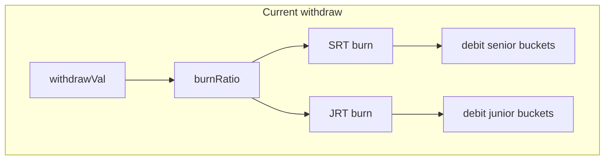
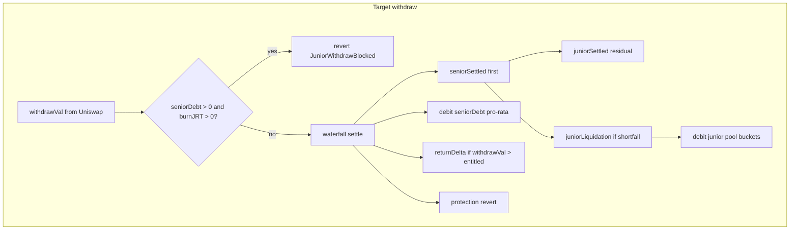

# Senior Payout Waterfall / Junior Liquidation + Senior Debt (Plan §8b)

## Goal

Close the gap documented in [04_share-based_yield_withdraw plan §8b](.cursor/plans/04_share-based_yield_withdraw_1b98b61b.plan.md): move from parallel share burn bookkeeping to **senior-first reserve settlement** per [design §3](.cursor/plans/00_tranche_lp_design.input.md), plus **Model A senior debt** per [design §10.6](.cursor/plans/00_tranche_lp_design.input.md).

**In scope:** waterfall math, junior liquidation, protection revert, senior haircut on insolvency, return-delta excess clawback, `seniorDebt` accrual/clearance, JRT withdraw gating, tests.

**Out of scope:** insurance fund (Model B), dynamic senior rate model, epoch management.

---

## Current state

[`TrancheLPHook._settleTrancheWithdraw`](packages/hook/src/TrancheLPHook.sol) burns SRT/JRT pro-rata and debits buckets in parallel. [`_beforeRemoveLiquidity`](packages/hook/src/TrancheLPHook.sol) only accrues; `PendingWithdraw` burn fields are unused. `afterRemoveLiquidityReturnDelta` is **false**.

[`_accruePool`](packages/hook/src/TrancheLPHook.sol) caps `seniorAccrual` at `feeEarned` — unfunded `seniorDue` is silently dropped. No `seniorDebt` field; juniors can withdraw freely during fee shortfalls.





---

## 1. Senior debt — accrual & clearance (Model A)

### Data model — [`TrancheTypes.sol`](packages/hook/src/lib/TrancheTypes.sol)

Add to `TranchePool`:

```solidity
uint256 seniorDebt;  // unfunded seniorDue owed to seniors, backed by junior capital
```

Extend `YieldAccrued` event (append field):

```solidity
event YieldAccrued(..., uint256 seniorDebtDelta);
```

### Accrual rewrite — [`TrancheLPHook._accruePool`](packages/hook/src/TrancheLPHook.sol)

Replace capped-only accrual with debt-aware routing:

```solidity
uint256 seniorDue = TrancheMath.computeSeniorDue(...);
uint256 fees = pool.feeAccumulator;  // cleared as today

// 1. Fees pay existing senior debt first
uint256 debtPaid = fees < pool.seniorDebt ? fees : pool.seniorDebt;
pool.seniorDebt -= debtPaid;
fees -= debtPaid;

// 2. Fund current-period senior yield from remaining fees
uint256 seniorAccrual = fees < seniorDue ? fees : seniorDue;
pool.seniorYieldAccrued += seniorAccrual;
fees -= seniorAccrual;

// 3. Unfunded senior promise → debt against juniors
uint256 newDebt = seniorDue - seniorAccrual;
pool.seniorDebt += newDebt;

// 4. IL + junior residual (unchanged shape, on remaining fees)
int256 juniorNet = TrancheMath.computeJuniorNet(fees, 0, ilIncremental);
// ... existing juniorNet bucket routing ...
```

**Key behavior:** `seniorDue` is always recognized each accrual tick. Shortfalls accumulate in `seniorDebt` rather than being dropped. Juniors are implicitly backing this debt until fees or liquidation clear it.

### Senior pool total (shares index against debt)

Update [`TrancheMath.seniorPool`](packages/hook/src/lib/TrancheMath.sol):

```solidity
function seniorPool(uint256 seniorCapital, uint256 seniorYieldAccrued, uint256 seniorDebt)
    internal pure returns (uint256)
{
    return seniorCapital + seniorYieldAccrued + seniorDebt;
}
```

All call sites (`sharesToMint`, `sharesToValue`, `positionValue`, withdraw settlement) must pass `pool.seniorDebt`. SRT shares now represent claims on principal + funded yield + unfunded debt.

### Debt clearance on withdraw

During waterfall settlement, `seniorSettled` debits buckets **senior-first**:

1. `seniorYieldAccrued` (funded yield)
2. `seniorDebt` (unfunded promise)
3. `seniorCapital` (principal)

Use `TrancheMath.debitSeniorBuckets(seniorSettled, seniorCapital, seniorYieldAccrued, seniorDebt)` returning updated bucket values.

Junior liquidation (`juniorLiquidated`) also clears `seniorDebt` before `seniorCapital` when it funds a senior shortfall.

---

## 2. JRT withdraw gating

### Rule

Per design §10.6 Model A: **juniors cannot withdraw while `seniorDebt > 0`.**

Gate in [`_beforeRemoveLiquidity`](packages/hook/src/TrancheLPHook.sol) after computing preview `burnJRT`:

```solidity
if (pool.seniorDebt > 0 && burnJRT > 0) revert JuniorWithdrawBlocked();
```

| LP type | `seniorDebt > 0` behavior |
|---------|---------------------------|
| Pure junior (φ=0) | All withdraws blocked |
| Mixed φ | Any withdraw blocked (pro-rata burns JRT) |
| Pure senior (φ=1) | Withdraw allowed; SRT claim includes debt share |

**No partial JRT bypass** in this iteration — mixed LPs must wait for debt clearance or exit is fully blocked. Simpler and matches "junior cannot withdraw" literally.

### Error

```solidity
error JuniorWithdrawBlocked(uint256 seniorDebt);
```

### Debt clearance paths (unblocks juniors)

1. Swap fees accrue and `_accruePool` pays down `seniorDebt`
2. Senior LP exit triggers `juniorLiquidated` which retires debt from junior buckets
3. Test helper `setSeniorDebtForTest(id, amount)` for deterministic tests

---

## 3. Waterfall math — [`TrancheMath.sol`](packages/hook/src/lib/TrancheMath.sol)

Add pure functions (unit-tested in [`TrancheMath.t.sol`](packages/hook/test/TrancheMath.t.sol)):

| Function | Logic |
|----------|-------|
| `poolReserveValue(seniorCapital, juniorCapital)` | `V_pool` MVP proxy = principal reserves |
| `computeWithdrawWaterfall(...)` | Senior-first cash split + junior liquidation + insolvency haircut; inputs include `seniorDebt` in `seniorPool` |
| `debitSeniorBuckets(amount, capital, yieldAccrued, debt)` | Debit yield → debt → capital in order |
| `debitJuniorBuckets(amount, capital, feeAccrued, ilAccrued)` | Existing pro-rata pattern |
| `checkSeniorProtection(seniorPayout, vPool, juniorPoolAfter)` | Design §3 protection |
| `splitWithdrawDelta(amount0, amount1, takeTotal)` | Return-delta token split |
| `accrueSeniorDebt(fees, seniorDue, debtPrior)` | Pure helper mirroring accrual debt logic for unit tests |

**Invariant:** `seniorSettled + juniorSettled <= withdrawVal`; `seniorDebt` never increases on junior withdraw (gated).

---

## 4. Types & errors — [`TrancheTypes.sol`](packages/hook/src/lib/TrancheTypes.sol)

Extend `PendingWithdraw`:

```solidity
uint256 seniorClaim;
uint256 juniorClaim;
uint256 burnSRT;
uint256 burnJRT;
bool jrtBlocked;  // true when gate triggered (debug/test)
```

Add errors:

- `SeniorProtectionViolated()`
- `JuniorWithdrawBlocked(uint256 seniorDebt)`
- `InsufficientJuniorBuffer(uint256 required, uint256 available)` (optional)

Extend `TrancheWithdrawn` (append fields):

```solidity
uint256 seniorSettled;
uint256 juniorSettled;
uint256 juniorLiquidated;
uint256 seniorDebtBurned;
```

Update [`ScenarioRunner._stepLpWithdraw`](packages/hook/test/utils/ScenarioRunner.sol) event decode.

---

## 5. Hook permission & redeploy bitmap

In [`TrancheLPHook.getHookPermissions`](packages/hook/src/TrancheLPHook.sol):

```solidity
afterRemoveLiquidityReturnDelta: true
```

**Tests must update hook address mining** in [`TrancheLPHook.t.sol`](packages/hook/test/TrancheLPHook.t.sol) to OR in `Hooks.AFTER_REMOVE_LIQUIDITY_RETURNS_DELTA_FLAG` (`1 << 0`).

Import [`CurrencySettler`](packages/hook/lib/uniswap-hooks/src/utils/CurrencySettler.sol); donate excess to pool (same pattern as `LiquidityPenaltyHook`).

---

## 6. Withdraw flow rewrite — [`TrancheLPHook.sol`](packages/hook/src/TrancheLPHook.sol)

### `_beforeRemoveLiquidity`

1. `_accruePool`
2. Decode recipient; load position + pool
3. Estimate `withdrawVal` from `ModifyLiquidityParams.liquidityDelta` + `LiquidityAmounts`
4. Compute share burns + `seniorClaim` / `juniorClaim` (using `seniorPool` incl. debt)
5. **JRT gate:** revert if `pool.seniorDebt > 0 && burnJRT > 0`
6. `checkSeniorProtection` on projected state; revert if violated
7. Store preview in `_pendingWithdraw`

### `_settleTrancheWithdraw` (rewrite)

1. Recompute burns from actual `withdrawVal`
2. `computeWithdrawWaterfall`
3. Debit senior buckets via `debitSeniorBuckets` (tracks `seniorDebtBurned`)
4. Debit junior buckets for `juniorSettled` + cross-tranche `juniorLiquidated`
5. Burn SRT/JRT, update position
6. Re-run protection; emit extended `TrancheWithdrawn`

### `_afterRemoveLiquidity`

1. `_settleTrancheWithdraw`
2. Claw back excess via return delta + `donate`
3. Return `(selector, returnDelta)`

---

## 7. Tests

### A. [`TrancheMath.t.sol`](packages/hook/test/TrancheMath.t.sol)

| Test | Asserts |
|------|---------|
| `test_waterfall_seniorFirst` | senior settled before junior |
| `test_waterfall_juniorLiquidation` | liquidation covers senior shortfall |
| `test_waterfall_protection` | protection boundaries |
| `test_waterfall_seniorHaircut` | insolvency haircut |
| `test_splitWithdrawDelta` | token split sums correctly |
| `test_accrueSeniorDebt_shortfall` | `seniorDue=10, fees=3` → `accrual=3, debt+=7` |
| `test_accrueSeniorDebt_feesPayDebtFirst` | `debt=5, fees=8` → `debt=0`, remainder funds yield |
| `test_debitSeniorBuckets_order` | debits yield, then debt, then capital |

### B. [`TrancheLPHook.t.sol`](packages/hook/test/TrancheLPHook.t.sol)

| Test | Setup | Asserts |
|------|-------|---------|
| `test_seniorDebt_accruesOnFeeShortfall` | Deposit, warp 30d, tiny swap (fees < seniorDue) | `seniorDebt > 0`, `seniorYieldAccrued` only funded portion |
| `test_seniorDebt_clearedByFees` | Accrue debt, large swap | `seniorDebt == 0` |
| `test_jrtWithdraw_blockedWhileDebt` | Junior LP, inject debt via helper | `vm.expectRevert(JuniorWithdrawBlocked)` |
| `test_srtWithdraw_allowedWhileDebt` | Senior-only LP, inject debt | withdraw succeeds; `seniorDebt` decreases |
| `test_mixedLpWithdraw_blockedWhileDebt` | 50/50 LP, inject debt | revert on any withdraw |
| `test_waterfall_solventSeniorGetsYield` | 75% senior, swap+accrue, withdraw | senior settled includes yield |
| `test_juniorLiquidation_onSeniorExit` | Senior + junior LPs, accrue, senior exits | `juniorLiquidated > 0`, may clear debt |
| `test_protection_reverts_seniorExit` | High IL | `SeniorProtectionViolated` |
| `test_juniorWipeout_seniorHaircut` | Heavy IL | haircut on senior claim |
| `test_returnDelta_clawsExcess` | Inflated accruals | LP receives ≤ entitled |

### C. Test harness — [`TrancheLPHookTestable.sol`](packages/hook/test/TrancheLPHookTestable.sol)

```solidity
function setPoolAccrualsForTest(PoolId id, uint256 seniorYield, uint256 juniorFee, uint256 il) external;
function setSeniorDebtForTest(PoolId id, uint256 debt) external;
function previewWithdrawWaterfall(PoolId id, address lp, uint256 withdrawVal) external view returns (...);
```

### D. Regression

- Update existing share/yield withdraw tests to pass `seniorDebt` into `seniorPool` helpers.
- `forge test --match-contract TrancheLPHook` and `TrancheScenario`.

---

## 8. Files touched

| File | Change |
|------|--------|
| [`TrancheMath.sol`](packages/hook/src/lib/TrancheMath.sol) | Waterfall, debt accrual/clearance, bucket debit order |
| [`TrancheTypes.sol`](packages/hook/src/lib/TrancheTypes.sol) | `seniorDebt`, errors, events |
| [`TrancheLPHook.sol`](packages/hook/src/TrancheLPHook.sol) | Accrual rewrite, JRT gate, withdraw waterfall, return delta |
| [`TrancheLPHookTestable.sol`](packages/hook/test/TrancheLPHookTestable.sol) | Debt injection + preview |
| [`TrancheMath.t.sol`](packages/hook/test/TrancheMath.t.sol) | Waterfall + debt unit tests |
| [`TrancheLPHook.t.sol`](packages/hook/test/TrancheLPHook.t.sol) | Debt + gate + waterfall integration tests |
| [`ScenarioRunner.sol`](packages/hook/test/utils/ScenarioRunner.sol) | Event decode |

---

## 9. Verification

```bash
cd packages/hook && forge test --match-contract TrancheMath
cd packages/hook && forge test --match-contract TrancheLPHook
cd packages/hook && forge test --match-contract TrancheScenario
```

---

## Risk notes

- **Return delta is HIGH risk** — only claw back proven excess.
- **Cross-tranche liquidation** dilutes junior LPs without burning JRT.
- **JRT gate blocks mixed LPs** entirely during debt — document UX implication; senior-only exits remain possible.
- **`seniorDebt` in `seniorPool`** increases SRT exchange rate; second depositor dilution tests may need updated expectations when debt is nonzero.
