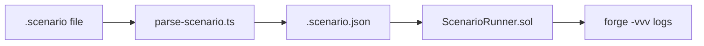

# Scenario instructions: getPoolState, getUserState, getPoolPosition, burnShare

## Context

Scenario tests flow through three layers:



Existing ops use `op: rest` syntax (e.g. `lpWithdraw: lpUser2, 100`). Debug output already exists in [`ScenarioRunner.sol`](packages/hook/test/utils/ScenarioRunner.sol) via `emit log_named_uint` in `_stepLpWithdraw`.

Hook state is accessible via public getters on [`TrancheLPHook.sol`](packages/hook/src/TrancheLPHook.sol):
- `hook.pools(poolId)` → full [`TranchePool`](packages/hook/src/lib/TrancheTypes.sol) struct (14 fields)
- `hook.positions(poolId, user)` → full [`LPPosition`](packages/hook/src/lib/TrancheTypes.sol) struct (7 fields)

## Syntax (in `.scenario` files)

| Instruction | Example | Args |
|---|---|---|
| `getPoolState` | `getPoolState:` | none |
| `getUserState` | `getUserState: lpUser1` | user name |
| `getPoolPosition` | `getPoolPosition: lpUser1` | user name |
| `burnShare` | `burnShare: lpUser1, 10, 20` | user, srtAmount, jrtAmount |

Note: [`swapEthFullSenior.scenario`](packages/hook/test/scenarios/swapEthFullSenior.scenario) line 6 has a draft `poolState` (no colon) that currently fails parsing — update to `getPoolState:` when implementing.

## 1. TypeScript parser

**[`scenario-types.ts`](packages/hook/scripts/scenario-types.ts)** — extend `ScenarioStep` union:

```ts
| { op: "getPoolState" }
| { op: "getUserState"; user: string }
| { op: "getPoolPosition"; user: string }
| { op: "burnShare"; user: string; srtAmount: string; jrtAmount: string }
```

**[`parse-scenario.ts`](packages/hook/scripts/parse-scenario.ts)** — add four `case` branches in `parseStep`:

- `getPoolState`: no fields required; return `{ op: "getPoolState" }`
- `getUserState`: require `fields[0]` as user (same pattern as `userAssert`)
- `getPoolPosition`: require `fields[0]` as user
- `burnShare`: require `user`, `srtAmount`, `jrtAmount` (same CSV pattern as `lpDeposit`); at least one amount must be non-zero; amounts use human-readable decimals (e.g. `10` → 10e18), parsed via existing `_parseHumanAmount` in the runner

## 2. Test hook helper for burnShare

Production [`TrancheLPHook.sol`](packages/hook/src/TrancheLPHook.sol) only burns SRT/JRT inside `_settleTrancheWithdraw` (triggered by liquidity removal). There is no standalone burn-by-amount API.

Add `burnSharesForTest(PoolId id, address lp, uint256 burnSRT, uint256 burnJRT)` to [`TrancheLPHookTestable.sol`](packages/hook/test/TrancheLPHookTestable.sol) that:

1. Reverts with `InsufficientReceiptTokens` if `burnSRT > pos.srtBalance` or `burnJRT > pos.jrtBalance`
2. Mirrors the share-burn bookkeeping from `_settleTrancheWithdraw` (lines 429–442):
   - `pool.srtTotalSupply -= burnSRT` / `pool.jrtTotalSupply -= burnJRT`
   - Pro-rata `seniorDeposit` / `juniorDeposit` reduction
   - `pos.srtBalance -= burnSRT` / `pos.jrtBalance -= burnJRT`
   - `_burn(recipient, srtId(id), burnSRT)` / `_burn(recipient, jrtId(id), burnJRT)`
3. **Does not** run waterfall settlement (no pool capital bucket debits, no token transfers) — this is a test-only share mutation for scenario setup/teardown

## 3. Solidity runner

**[`ScenarioRunner.sol`](packages/hook/test/utils/ScenarioRunner.sol)** — four step handlers:

### Dispatch (`_dispatchStep`)

Add branches before the `revert("unknown scenario op")` fallback for `getPoolState`, `getUserState`, `getPoolPosition`, `burnShare`.

### `_stepGetPoolState`

Read `hook.pools(poolId)` and emit all 14 `TranchePool` fields with prefixed keys:

```
getPoolState seniorCapital
getPoolState juniorCapital
getPoolState seniorYieldAccrued
getPoolState seniorDebt
getPoolState juniorFeeAccrued
getPoolState ilAccrued
getPoolState feeAccumulator
getPoolState k0
getPoolState seniorFixedRate
getPoolState lastAccrualTime
getPoolState epochStart
getPoolState seniorDepositsPaused  (log_named_uint: 0/1)
getPoolState srtTotalSupply
getPoolState jrtTotalSupply
```

Reuse the same destructuring pattern as [`TrancheLPHook.t.sol` `_getPoolState`](packages/hook/test/TrancheLPHook.t.sol) (line 473).

### `_stepGetUserState`

Resolve user via `_getOrCreateUser` (so pre-deposit inspection shows zero balances). Log:

- `getUserState ethBalance` — `ethCurrency.balanceOf(user)` via `log_named_decimal_uint(..., 18)`
- `getUserState usdcBalance` — `usdcCurrency.balanceOf(user)` via `log_named_decimal_uint(..., 18)`
- `getUserState srtBalance` — `srtBalance` from `hook.positions(poolId, user.user)`
- `getUserState jrtBalance` — `jrtBalance` from `hook.positions(poolId, user.user)`

Per your choice: receipt token balances only (not % supply or economic value).

### `_stepGetPoolPosition`

Resolve user via `_getOrCreateUser`. Read `hook.positions(poolId, user.user)` and emit all 7 `LPPosition` fields:

```
getPoolPosition seniorDeposit
getPoolPosition juniorDeposit
getPoolPosition phi
getPoolPosition depositTime
getPoolPosition srtBalance
getPoolPosition jrtBalance
getPoolPosition lpLiquidity
```

### `_stepBurnShare`

Resolve user via `_getUser` (must exist — burning from a non-existent LP is an error). Parse `srtAmount` and `jrtAmount` from JSON via `_parseHumanAmount`. Call `hook.burnSharesForTest(poolId, user.user, srtAmount, jrtAmount)`. Emit confirmation logs:

```
burnShare user
burnShare srtBurned
burnShare jrtBurned
```

## 4. Scenario file touch-up

Update [`swapEthFullSenior.scenario`](packages/hook/test/scenarios/swapEthFullSenior.scenario) line 6 from `poolState` → `getPoolState:` (optional: add `getUserState: lpUser1` / `getPoolPosition: lpUser1` at useful checkpoints).

Re-parse all scenarios (`bun run scripts/test-all-scenarios.ts` or per-file `parse-scenario.ts`) to regenerate `.scenario.json` files.

## 5. Verification

```bash
cd packages/hook
bun run scripts/parse-scenario.ts test/scenarios/swapEthFullSenior.scenario
SCENARIO_JSON=test/scenarios/swapEthFullSenior.scenario.json \
  forge test --match-contract TrancheScenario --match-test test_scenario -vvv
```

Confirm `getPoolState`, `getUserState`, and `getPoolPosition` log lines appear in forge output. Existing scenario tests should still pass (debug ops are side-effect-free; `burnShare` only used when explicitly added to a scenario).

## Files changed (summary)

| File | Change |
|---|---|
| [`scenario-types.ts`](packages/hook/scripts/scenario-types.ts) | 4 new step types |
| [`parse-scenario.ts`](packages/hook/scripts/parse-scenario.ts) | 4 new parse cases |
| [`TrancheLPHookTestable.sol`](packages/hook/test/TrancheLPHookTestable.sol) | `burnSharesForTest` helper |
| [`ScenarioRunner.sol`](packages/hook/test/utils/ScenarioRunner.sol) | dispatch + 4 step handlers |
| [`swapEthFullSenior.scenario`](packages/hook/test/scenarios/swapEthFullSenior.scenario) | fix invalid `poolState` line |
| `*.scenario.json` | regenerated |
